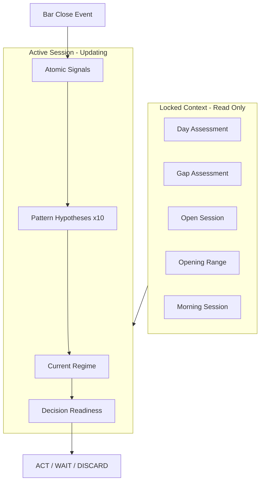
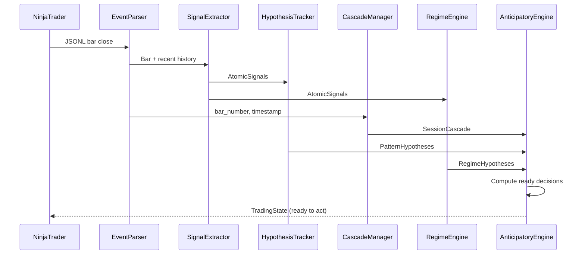

# Anticipatory Trading State Machine

## Current State Analysis

The codebase already has solid foundations:

- **Pattern detection**: Two-tier system in [src/live/pattern_matcher.py](src/live/pattern_matcher.py) (hardcoded + LLM-extracted rules)
- **Session timing**: Phase detection with modifiers in [src/live/session_timing.py](src/live/session_timing.py)
- **Decision tree**: Scenario management with probability normalization in [src/live/decision_tree.py](src/live/decision_tree.py)
- **Context building**: Rolling bar window in [src/live/context.py](src/live/context.py)
- **Opening range**: High/low tracking in [src/live/opening_range.py](src/live/opening_range.py)

## What's Missing

1. **Pattern Hypothesis Tracker** - tracking multiple patterns at different completion stages
2. **Atomic Signal Extractor** - comprehensive weak signals from OHLC
3. **Session Cascade Manager** - hierarchical locked/active session states
4. **Anticipatory Decision Readiness** - pre-computed "if X then Y" for each hypothesis

## Architecture



## New Components

### 1. Atomic Signal Extractor

**File**: `src/live/signal_extractor.py`

Extracts weak, measurable signals from recent bars:

```python
@dataclass(frozen=True)
class AtomicSignals:
    follow_through_bull: float   # 0-1, strength of bull continuation
    follow_through_bear: float   # 0-1, strength of bear continuation
    overlap_ratio: float         # 0-1, bar overlap (high = congestion)
    range_compression: float     # 0-1, range shrinking vs expanding
    tail_asymmetry: float        # -1 to 1, neg=selling pressure, pos=buying
    body_relative_size: float    # current body vs recent average
    ema_distance_normalized: float  # distance from EMA as multiple of ATR
    breakout_failure_rate: float # recent breakout failures
    leg_exhaustion: float        # 0-1, signs of trend exhaustion
```

Each signal is a float measurement, not a binary classification. Signals are extracted from the last N bars using vectorized calculations.

### 2. Pattern Hypothesis Tracker

**File**: `src/live/pattern_hypothesis.py`

Tracks multiple potential patterns simultaneously:

```python
@dataclass
class PatternHypothesis:
    pattern_id: str            # "wedge", "double_bottom", etc.
    completion_pct: float      # 0.0 - 1.0
    bars_to_complete: int      # estimated bars remaining
    required_signal: str       # signal bar type needed for entry
    context_score: float       # quality assessment from signals
    decision_if_complete: str  # "BUY", "SELL", "WAIT"
    invalidation_condition: str  # what kills this hypothesis
    evidence_ids: list[str]    # supporting chunks for retrieval
    created_at_bar: int
    last_updated_bar: int

class PatternHypothesisTracker:
    """Manages N parallel pattern hypotheses, updating each on bar close."""

    def update(self, bar: Bar, signals: AtomicSignals) -> list[PatternHypothesis]:
        # For each active hypothesis:
        # 1. Check invalidation (remove if invalid)
        # 2. Update completion percentage
        # 3. Recalculate context_score from signals
        # 4. Check for new potential patterns starting
        # Returns: current hypothesis list (sorted by completion * context)
```

**Pattern completion rules** loaded from `data/pattern_completion_rules.json`:
- Wedge: 3 pushes needed, track push count
- Double bottom: 2 lows within threshold
- Triangle: converging highs/lows over N bars

### 3. Session Cascade Manager

**File**: `src/live/session_cascade.py`

Manages hierarchical locked/active sessions:

```python
@dataclass(frozen=True)
class LockedSession:
    name: str              # "day", "gap", "open", "opening_range", etc.
    locked_at_bar: int
    locked_at_ts: datetime
    regime: str            # "trending", "ranging", "breakout"
    key_levels: tuple[int, ...]  # significant prices in ticks
    summary: str           # human-readable summary
    context_tags: tuple[str, ...]  # tags that apply downstream

@dataclass
class SessionCascade:
    locked_sessions: list[LockedSession]
    active_session_name: str
    active_session_start_bar: int

class SessionCascadeManager:
    """Manages session transitions and locking."""

    # Session boundaries (bar numbers are 5-min bars, 81 per RTH session)
    BOUNDARIES = {
        "open": (1, 6),          # 8:30-9:00 (first 30 min = 6 bars)
        "opening_range": (1, 12), # 8:30-9:30 (first 60 min = 12 bars)
        "morning": (1, 30),      # 8:30-11:00
        "lunch": (30, 54),       # 11:00-13:00
        "afternoon": (54, 78),   # 13:00-15:00
        "close": (72, 81),       # 14:30-15:00
    }

    def on_bar_close(self, bar_number: int, regime: str, ...) -> SessionCascade:
        # Lock sessions that have ended
        # Return updated cascade with new active session
```

### 4. Regime Inference Engine

**File**: `src/live/regime_inference.py`

Stacks atomic signals to infer probabilistic regimes:

```python
@dataclass(frozen=True)
class RegimeHypothesis:
    regime: str            # "trending_bull", "trending_bear", "range", etc.
    probability: float     # 0-1
    supporting_signals: list[str]   # which signals support this
    conflicting_signals: list[str]  # which signals conflict

class RegimeInferenceEngine:
    """Combines signals to infer regime probabilities."""

    def infer(self, signals: AtomicSignals, locked: list[LockedSession]) -> list[RegimeHypothesis]:
        # Signal stacking logic:
        # - High follow_through + low overlap → trending
        # - Low follow_through + high overlap → ranging
        # - High compression + prior trend → breakout potential
        # Weighted by locked session context
```

### 5. Anticipatory Decision Engine

**File**: `src/live/anticipatory_engine.py`

Orchestrates all components and pre-computes decisions:

```python
@dataclass(frozen=True)
class ReadyDecision:
    hypothesis_id: str
    trigger_condition: str  # "bull_reversal_bar", "break_above_X"
    action: str             # "BUY", "SELL"
    confidence: float
    reasoning: str

class AnticipatoryEngine:
    """Main orchestrator - one bar ahead decision readiness."""

    def __init__(self):
        self.signal_extractor = SignalExtractor()
        self.hypothesis_tracker = PatternHypothesisTracker()
        self.cascade_manager = SessionCascadeManager()
        self.regime_engine = RegimeInferenceEngine()

    def on_bar_close(self, ev: BarCloseEvent) -> TradingState:
        # 1. Extract atomic signals
        signals = self.signal_extractor.extract(recent_bars)

        # 2. Update session cascade (lock if boundary crossed)
        cascade = self.cascade_manager.on_bar_close(ev.bar_number, ...)

        # 3. Infer regime from signals + locked context
        regimes = self.regime_engine.infer(signals, cascade.locked_sessions)

        # 4. Update pattern hypotheses
        hypotheses = self.hypothesis_tracker.update(bar, signals)

        # 5. Pre-compute ready decisions for high-completion hypotheses
        ready = self._compute_ready_decisions(hypotheses, regimes, signals)

        return TradingState(
            locked_sessions=cascade.locked_sessions,
            active_session=cascade.active_session_name,
            regime_hypotheses=regimes,
            pattern_hypotheses=hypotheses,
            atomic_signals=signals,
            ready_decisions=ready,
        )
```

## Integration with Existing Code

- **Reuse** `PatternMatcher` for pattern detection (completion checking)
- **Reuse** `SessionPhase` for timing modifiers
- **Reuse** `MarketContextBuilder` for bar history
- **Extend** `DecisionTree` to accept `TradingState` from anticipatory engine
- **Keep** retrieval routing via pattern tags (existing flow)

## Data Flow



## Files to Create

| File | Purpose | Complexity |
| ------------------------------------ | ------------------------------ | ---------- |
| `src/live/signal_extractor.py` | Atomic signal extraction | Medium |
| `src/live/pattern_hypothesis.py` | Multi-hypothesis tracking | High |
| `src/live/session_cascade.py` | Session lock/active management | Medium |
| `src/live/regime_inference.py` | Signal stacking to regimes | Medium |
| `src/live/anticipatory_engine.py` | Main orchestrator | High |
| `data/pattern_completion_rules.json` | Pattern completion criteria | Low |

## Files to Modify

| File | Change |
| ----------------------------- | -------------------------------------------- |
| `src/live/decision_tree.py` | Accept TradingState from anticipatory engine |
| `src/live/pattern_matcher.py` | Add completion percentage calculation |

## Testing Strategy

1. **Unit tests** for each extractor/tracker in isolation
2. **Playback tests** using historical JSONL to verify:
   - Patterns detected before completion
   - Sessions lock at correct bars
   - Ready decisions trigger on expected conditions
3. **Visualization** of hypothesis evolution across a session

## Open Questions

1. **How many hypotheses to track?** Suggest cap at 10-15 to limit complexity
2. **Pattern completion rules** - extract from knowledge base or define manually?
3. **Signal weights for regime inference** - start with equal weights, tune later?

---

## Plain English Summary

### The Core Idea

The system thinks one bar ahead, like a chess player. At any moment it holds:

1. **"These 10 things might be happening"** - wedge 70% formed, double bottom 40% formed, etc.
2. **"Here's the context for each"** - follow-through weak, compression high, late in trend
3. **"If X happens, I'll do Y"** - if wedge completes + bull reversal bar → BUY

When the next bar closes, the system doesn't have to think. It just checks triggers.

### The Session Cascade

Your trading day is layers that lock as time passes:

- **Day assessment** (locked at open)
- **Gap assessment** (locked at open)
- **Open session** (locks at 9:00 AM)
- **Opening range** (locks at 9:30 AM)
- **Morning session** (locks at 11:00 AM)
- ... and so on

Each locked layer informs the active layer. The context cascades down.

### Atomic Signals vs Patterns

- **Patterns** = concepts: "wedge", "double bottom"
- **Signals** = measurements: follow-through (0.7), compression (0.8), exhaustion (0.3)

The pattern tells you WHAT you're looking at. The signals tell you WHETHER it's tradeable.

### The Hybrid Approach

This mirrors how a human trader thinks:

1. Scan → "Is that a wedge forming?"
2. Confirm → "Yes, converging highs/lows"
3. Contextualize → "But follow-through is weak, late in trend"
4. Decide → "Wait for more compression" or "Skip this one"

Pattern gets you in the chair. Signals tell you whether to act.
