# ML Vision Pipeline for Al Brooks Slides

## Goal

Extract structured, machine-readable data from 12,000+ trading slides with 95%+ accuracy:
- **Bar detection**: Bull/bear/doji classification with pixel-accurate wick/body positions
- **OHLC derivation**: Convert pixel positions to relative tick values for pattern detection
- **Annotation detection**: Green boxes (long entry), red boxes (short entry), blue boxes (exit), arrows, lines, highlights
- **Spatial association**: Link annotations to specific bars they reference

---

## EXECUTION GUARDRAILS (CRITICAL)

### MANDATORY BEHAVIORS (ALWAYS DO THESE)

1. **Read the target section FIRST**
   - Understand existing code before changing
   - Verify the line numbers are correct
   - Check for any recent changes

2. **Make ONLY the specified change**
   - Add ONLY the lines shown
   - At ONLY the location specified
   - With ONLY the logic described

3. **Preserve ALL existing code**
   - Keep all comments
   - Keep all docstrings
   - Keep all variable names
   - Keep all logic flow

4. **Use EXACT code from spec**
   - Copy-paste, don't paraphrase
   - Keep exact variable names
   - Keep exact log messages
   - Keep exact function calls

5. **Verify after each change**
   - Run the verification command
   - Check imports still work
   - Verify syntax is valid

6. **Report what you changed**
   - List files modified
   - List line numbers
   - Show git diff --stat
   - Confirm only specified changes made

7. **Test with verification commands**
   - Run all verification commands provided
   - Report pass/fail for each
   - DO NOT proceed if verification fails

8. **Check for conflicts**
   - Verify no duplicate imports
   - Verify no duplicate logic
   - Verify no name collisions

9. **Maintain code style**
   - Match existing indentation (spaces/tabs)
   - Match existing line endings
   - Match existing comment style

10. **Stop if uncertain**
    - If anything is unclear, STOP
    - If line numbers don't match, STOP
    - If code looks different, STOP
    - Ask before proceeding

### FORBIDDEN BEHAVIORS (NEVER DO THESE)

1. **DO NOT add unrelated changes**
   - No "improvements" not in spec
   - No refactoring while implementing
   - No style changes to existing code
   - No "cleanup" of nearby code

2. **DO NOT skip verification**
   - Never assume it works
   - Never skip import checks
   - Never skip syntax validation

3. **DO NOT modify existing tests**
   - Unless explicitly instructed
   - Add new tests, don't change old ones

4. **DO NOT change function signatures**
   - Unless explicitly instructed
   - Preserve backward compatibility

5. **DO NOT delete code without asking**
   - Deletions require explicit approval
   - Comment out first, delete later if confirmed

6. **DO NOT guess at missing information**
   - If the spec is incomplete, ASK
   - If file paths are unclear, ASK
   - If behavior is ambiguous, ASK

7. **DO NOT batch unrelated changes**
   - One logical change per commit
   - Separate concerns into separate PRs

8. **DO NOT ignore errors**
   - If something fails, report it immediately
   - Don't try to "work around" errors silently

### PROJECT-SPECIFIC GUARDRAILS

1. **Roboflow API calls**
   - Never delete datasets without confirmation
   - Always backup labels before bulk operations
   - Log all API responses for debugging

2. **Model training**
   - Never overwrite existing model versions
   - Always version models with timestamps
   - Save training configs with each run

3. **Slide processing**
   - Never modify original slide images
   - Always work on copies
   - Preserve slide ID mapping at all times

4. **Database operations**
   - Use temp DB by default (per project rules)
   - Never DROP tables without explicit confirmation
   - Always create migrations for schema changes

5. **Pattern detector integration**
   - Never modify existing pattern definitions
   - Add new patterns in separate files
   - Preserve exact Bar class interface

6. **OHLC extraction**
   - Always validate H >= max(O, C)
   - Always validate L <= min(O, C)
   - Flag invalid bars, don't silently fix them

### VERIFICATION COMMANDS

Run these after each phase:

```bash
# Syntax check
python -m py_compile src/vision/*.py

# Import check
python -c "from src.vision import *"

# Type check (if mypy installed)
mypy src/vision/ --ignore-missing-imports

# Run tests
pytest tests/vision/ -v

# Lint check
ruff check src/vision/
```

---

## GIT WORKFLOW (STRUCTURE FOR AI-ASSISTED DEVELOPMENT)

### Branch Naming Convention

```
main                          # Production-ready, always works
├── phase1/roboflow-setup     # Phase 1 work
├── phase2/slide-selection    # Phase 2 work
├── phase3/test-autolabeling  # Phase 3 work
├── phase4/train-initial-model # Phase 4 work
├── phase5/model-assisted-label # Phase 5 work
├── phase6/annotation-classes # Phase 6 work
├── phase7/post-processing    # Phase 7 work
├── phase8/pattern-integration # Phase 8 work
├── phase9/batch-inference    # Phase 9 work
├── phase10/db-integration    # Phase 10 work
└── fix/<issue-description>   # Bug fixes
```

### Commit Message Format

Use Conventional Commits with scope:

```
<type>(<scope>): <description>

Types:
  feat     - New feature
  fix      - Bug fix
  refactor - Code restructure (no behavior change)
  test     - Adding/updating tests
  docs     - Documentation only
  chore    - Maintenance (deps, configs)

Scope: vision, roboflow, ohlc, patterns, db

Examples:
  feat(vision): add Roboflow upload script
  feat(ohlc): implement body segmentation algorithm
  fix(vision): handle doji bars with zero body height
  test(ohlc): add unit tests for OHLC extraction
  refactor(vision): separate body segmentation into own module
  docs(vision): add docstrings to extraction functions
```

### Tag Naming Convention

Tag each phase completion as a checkpoint:

```bash
# Format: v<version>-<phase>-<status>
git tag -a v0.1-phase1-complete -m "Roboflow setup and project created"
git tag -a v0.2-phase3-complete -m "Auto-labeling tested, 150 slides labeled"
git tag -a v0.3-phase4-complete -m "Initial YOLOv8 model trained, 72% mAP"
git tag -a v0.4-phase5-complete -m "Model-assisted labeling done, 150 slides"
git tag -a v0.5-phase6-complete -m "Annotation classes added and trained"
git tag -a v0.6-phase7-complete -m "OHLC extraction pipeline working"
git tag -a v0.7-phase8-complete -m "Pattern detector integration complete"
git tag -a v0.8-phase9-complete -m "Batch inference on all 12k slides"
git tag -a v1.0-complete -m "Full pipeline complete and validated"
```

### Pre-Commit Hook Setup

Create `.git/hooks/pre-commit` (or use pre-commit framework):

```bash
#!/bin/bash
# Pre-commit hook for vision pipeline

echo "Running pre-commit checks..."

# 1. Check for syntax errors
echo "Checking Python syntax..."
python -m py_compile src/vision/*.py 2>/dev/null
if [ $? -ne 0 ]; then
    echo "FAILED: Python syntax errors found"
    exit 1
fi

# 2. Run linter
echo "Running linter..."
ruff check src/vision/ --quiet
if [ $? -ne 0 ]; then
    echo "FAILED: Linting errors found"
    exit 1
fi

# 3. Run quick tests (skip slow ones)
echo "Running quick tests..."
pytest tests/vision/ -x -q --tb=line -m "not slow" 2>/dev/null
if [ $? -ne 0 ]; then
    echo "FAILED: Tests failed"
    exit 1
fi

echo "All pre-commit checks passed!"
exit 0
```

Make executable: `chmod +x .git/hooks/pre-commit`

### Phase Start Checklist

Before starting any phase:

```bash
# 1. Ensure main is clean
git checkout main
git status  # Should show "nothing to commit, working tree clean"

# 2. Pull latest (if remote exists)
git pull origin main

# 3. Create phase branch
git checkout -b phase<N>/<description>

# 4. Verify branch
git branch  # Should show * phase<N>/<description>

# 5. Announce to AI
# "We are on branch phase<N>/<description>, working on Phase <N>: <goal>"
```

### During Phase Work

```bash
# After each logical unit of work (every 15-30 min or each function)
git add <specific-files>
git commit -m "<type>(<scope>): <description>"

# Check status frequently
git status
git diff --stat  # See what changed

# If something breaks and you need to undo
git checkout -- <file>        # Undo uncommitted changes to file
git reset HEAD~1 --soft       # Undo last commit, keep changes
git reset HEAD~1 --hard       # Undo last commit, discard changes
```

### Phase End Checklist

After completing each phase:

```bash
# 1. Run all verification commands
python -m py_compile src/vision/*.py
python -c "from src.vision import *"
pytest tests/vision/ -v
ruff check src/vision/

# 2. Review what changed in this phase
git log --oneline main..HEAD  # List all commits
git diff main --stat          # Summary of files changed
git diff main                 # Full diff (review carefully)

# 3. If all good, merge to main
git checkout main
git merge phase<N>/<description> --no-ff -m "Merge phase<N>: <summary>"

# 4. Tag the milestone
git tag -a v0.<N>-phase<N>-complete -m "<description of what's done>"

# 5. Push to remote (backup)
git push origin main --tags

# 6. Delete the feature branch (optional, keeps things clean)
git branch -d phase<N>/<description>

# 7. Verify main is healthy
git checkout main
pytest tests/vision/ -v
```

### Emergency Rollback

If something goes very wrong:

```bash
# Option 1: Revert to last tag
git checkout v0.<N>-phase<N>-complete

# Option 2: Revert specific commit
git revert <commit-hash>

# Option 3: Hard reset to tag (DESTRUCTIVE - loses uncommitted work)
git reset --hard v0.<N>-phase<N>-complete

# Option 4: Abandon current branch and start fresh
git checkout main
git branch -D phase<N>/<description>  # Delete broken branch
git checkout -b phase<N>/<description>  # Start fresh
```

### Git Commands for AI Context

When giving me tasks, include:

```
Current branch: phase7/post-processing
Last tag: v0.6-phase6-complete
Working on: OHLC extraction from bounding boxes
Files in scope: src/vision/ohlc_extractor.py, src/vision/body_segmentation.py
```

This helps me:
- Stay within scope (won't touch files outside the phase)
- Know what's safe to modify
- Reference the last stable state if needed

---

## CONDITIONAL GUARDRAILS (PROJECT-SPECIFIC)

### Expensive Operations

This project involves costly operations that should not be re-run carelessly.

| Operation                       | Estimated Cost            | Estimated Time |
| ------------------------------- | ------------------------- | -------------- |
| Roboflow auto-label (per image) | ~$0.01                    | instant        |
| Roboflow model training         | $0 (free tier) / $5+ (paid) | 30-60 min      |
| Batch inference on 12k slides   | ~$0 (local)               | 2-4 hours      |
| Gemini API re-extraction        | ~$15-30 (12k slides)      | 4-8 hours      |

**BEFORE re-running any expensive operation:**
1. Check if output already exists (may not need re-run)
2. Get explicit approval: "Phase X failed. Re-run will cost ~$Y and take ~Z time. Proceed?"
3. Log the re-run reason in commit message

**Validate BEFORE expensive phases:**
- Always run cheap validation before expensive operations
- Example: Validate 10 slides manually BEFORE running batch on 12k

### Non-Destructive Pipeline

Each phase writes to its own location. Re-running Phase N does NOT destroy earlier phase outputs.

| Phase    | Input Source    | Output Location                         | Preserved? |
| -------- | --------------- | --------------------------------------- | ---------- |
| Phase 1  | N/A             | Roboflow project created                | YES        |
| Phase 2  | Slide images    | Selected slides list                    | YES        |
| Phase 3  | Selected slides | Roboflow labels                         | YES        |
| Phase 4  | Labels          | `models/v1/`                            | YES        |
| Phase 5  | Model v1        | More labels                             | YES        |
| Phase 6  | All labels      | `models/v2/`                            | YES        |
| Phase 7  | Model v2        | `src/vision/*.py`                       | YES        |
| Phase 8  | Vision code     | `src/vision/pattern_detector_bridge.py` | YES        |
| Phase 9  | All code        | `out/extractions/*.json`                | YES        |
| Phase 10 | Extractions     | Database tables                         | YES        |

**Rules:**
- Each phase reads from previous phase output
- Each phase writes ONLY to its designated location
- NEVER overwrite model versions - create new version
- Re-running Phase N only affects Phase N outputs

### Sacred Values (DO NOT MODIFY)

These values are validated/calibrated. Do not adjust to "make it work."

| Value                  | Location             | Locked At   | Why                             |
| ---------------------- | -------------------- | ----------- | ------------------------------- |
| `H >= max(O, C)`       | OHLC validation      | Always true | Candle geometry invariant       |
| `L <= min(O, C)`       | OHLC validation      | Always true | Candle geometry invariant       |
| `body_threshold = 0.5` | body_segmentation.py | 0.5         | Calibrated for Al Brooks slides |
| `mAP target >= 0.95`   | Success criteria     | 0.95        | Required for pattern detection  |
| `bar_count = 81`       | QC check             | 81          | Standard trading day bars       |

**FORBIDDEN:**
- DO NOT lower mAP threshold to "pass" a failing model
- DO NOT disable OHLC validation to "handle" bad extractions
- DO NOT change bar_count expectation - flag anomalies instead

### Intra-Task Checkpointing (Long-Running Operations)

For batch processing 12k slides:

```markdown
### CHECKPOINT PROTOCOL

Every 500 slides (or every 30 minutes):
1. Log progress: "Processed X/12000. Last slide: slide_XXXX. Errors: Y"
2. Save checkpoint: Write progress to `out/extractions/_checkpoint.json`
3. If error rate > 5%: STOP immediately. Do not continue. Report.

DO NOT attempt to fix errors and continue. Report and wait.

Checkpoint file format:
{
  "last_processed": "slide_0500",
  "total_processed": 500,
  "total_errors": 3,
  "error_slides": ["slide_0123", "slide_0456", "slide_0489"],
  "timestamp": "2026-02-02T15:30:00Z"
}
```

### Pre/Post Validation Protocol

**Before starting any phase:**

```powershell
# Pre-validation checklist
# 1. Check required inputs exist
# 2. Check inputs are valid format
# 3. Check sufficient disk space (for batch operations)
# 4. Check API connectivity (for Roboflow phases)
```

**After completing any phase:**

```powershell
# Post-validation checklist
# 1. Check all expected outputs exist
# 2. Check outputs are valid (not empty, correct format)
# 3. Check counts are in expected range
# 4. Run quick spot-check on 5-10 random outputs
```

**IF VALIDATION FAILS:** STOP. Do not proceed to next phase. Report the failure.

### What To Do When Stuck

**1. Script throws an error?**
- Copy EXACT error message
- Check if it's a known issue (see Troubleshooting below)
- If not covered: STOP, do not improvise, ask

**2. Output file is empty or malformed?**
- DO NOT modify script to suppress the error
- DO NOT modify thresholds or parameters
- Report: which file, what size, what error
- Wait for instruction

**3. Bar count is wrong (not 81)?**
- Log: slide ID, actual count, expected count
- DO NOT "fix" by adjusting expectation
- Flag the slide for manual review
- Continue processing other slides

**4. OHLC validation fails (H < O or L > C)?**
- Log: slide ID, bar index, invalid values
- DO NOT disable validation
- Flag the bar as invalid in output
- Continue processing

**5. Model accuracy below target?**
- Log: actual mAP, target mAP, confusion matrix
- DO NOT lower the target to "pass"
- Report: may need more training data
- Wait for instruction

**6. Roboflow API error?**
- Log: exact error message, operation attempted
- Check Roboflow status page
- Retry once after 60 seconds
- If still fails: STOP and report

**7. Tempted to "just fix it quickly"?**
- STOP
- If it's not in this troubleshooting list, it's not approved
- Log the issue and ask

### Troubleshooting (Known Issues)

#### "CUDA out of memory" during inference
**Cause:** Batch size too large for GPU memory
**Fix:** Reduce batch size in inference script:
```python
# Change from
results = model.predict(images, batch=32)
# To
results = model.predict(images, batch=8)
```

---

#### "No module named 'ultralytics'"
**Cause:** YOLO not installed in current environment
**Fix:**
```bash
pip install ultralytics
```

---

#### "Roboflow API rate limit exceeded"
**Cause:** Too many API calls in short period
**Fix:** Add delay between calls:
```python
import time
time.sleep(1)  # 1 second between API calls
```

---

#### "FileNotFoundError: slide_XXXX.png"
**Cause:** Slide ID mismatch between list and actual files
**Fix:** Verify slide exists, check for naming convention differences (leading zeros, etc.)

---

## Architecture Overview

```mermaid
flowchart TD
    subgraph training [Training Phase]
        RF[Roboflow Candlestick Dataset] --> Fork[Fork and Extend]
        Slides[10-20 Test Slides] --> AutoLabel[Try Auto-Labeling]
        Fork --> AutoLabel
        AutoLabel --> Eval{Accuracy >= 30%?}
        Eval -->|Yes| AutoAll[Auto-label All 150]
        Eval -->|No| Manual50[Manual Label 50]
        AutoAll --> Correct[Correct Errors]
        Manual50 --> Train1[Train Initial Model]
        Correct --> Train1
        Train1 --> Prelabel[Pre-label Remaining]
        Prelabel --> CorrectMore[Correct Errors]
        CorrectMore --> Train2[Retrain]
        Train2 --> Iterate[Iterate until 95%+]
    end

    subgraph inference [Inference Pipeline]
        Input[Slide Image] --> YOLO[YOLOv8 Detection]
        YOLO --> Bars[Bar Bounding Boxes]
        YOLO --> Annot[Annotation Boxes]
        Bars --> PostProc[Post-Processing]
        PostProc --> OHLC[Pixel OHLC Values]
        OHLC --> Pattern[Pattern Detector]
        Annot --> Assoc[Spatial Association]
        Assoc --> Output[Structured JSON]
    end
```



## Phase 1: Setup and Transfer Learning (Day 1)

### 1.1 Create Roboflow Account and Project

- Sign up at [roboflow.com](https://roboflow.com)
- Create project: "al-brooks-slides"
- Set annotation type: Object Detection

### 1.2 Fork Existing Candlestick Dataset

- Source: [Roboflow Universe Candlestick Datasets](https://universe.roboflow.com/search?q=candlestick)
- Look for datasets with individual bar detection (not pattern-level)
- Fork to your workspace as starting point

### 1.3 Define Detection Classes

**Phase 1 Classes (Bars only):**
- `bull_bar` - Green/hollow candle (close > open)
- `bear_bar` - Red/filled candle (close < open)
- `doji` - Body < 20% of range

**Phase 2 Classes (Annotations):**
- `green_box` - Long entry zone
- `red_box` - Short entry zone
- `blue_box` - Exit/take profit zone
- `arrow_up` - Green arrow pointing up
- `arrow_down` - Red arrow pointing down
- `drawn_arrow` - PowerPoint arrow with text
- `highlight_region` - Shaded area
- `trend_line` - Angled line (wedge)
- `horizontal_line` - Support/resistance line

## Phase 2: Strategic Slide Selection (Day 1-2)

### 2.1 Sample 150 Diverse Slides

Select from your 12,000+ slides covering:

| Category              | Count | Selection Criteria               |
| --------------------- | ----- | -------------------------------- |
| Clean 81-bar charts   | 30    | No annotations, clear bars       |
| Green box slides      | 20    | Has long entry annotations       |
| Red box slides        | 20    | Has short entry annotations      |
| Blue box slides       | 15    | Has exit annotations             |
| Arrow slides          | 20    | Has pointing arrows with text    |
| Highlight slides      | 15    | Has shaded regions               |
| 6-box building blocks | 15    | Multi-panel layout               |
| Messy/cluttered       | 15    | Multiple overlapping annotations |

### 2.2 Upload to Roboflow

- Batch upload selected slides
- Maintain slide ID mapping for traceability

**Script location:** `src/vision/upload_to_roboflow.py`

## Phase 3: Test Auto-Labeling First (Day 2)

**Goal:** Determine if Roboflow's auto-labeling is good enough to speed up the process.

### 3.1 Upload Test Batch

Upload 10-20 diverse slides to Roboflow as a test batch.

### 3.2 Try Auto-Labeling Options

Test these approaches and compare results:

| Option | Method                | How to Try                                                                                                                       |
| ------ | --------------------- | -------------------------------------------------------------------------------------------------------------------------------- |
| A      | Universe Model        | Import a pre-trained candlestick model, run inference on your slides                                                             |
| B      | Roboflow Auto Label   | Use built-in auto-label feature                                                                                                  |
| C      | Label Assist (GPT-4V) | Describe: "Detect each candlestick bar, label as bull_bar if hollow/green, bear_bar if filled/black, doji if body is very small" |

### 3.3 Evaluate Results

For each auto-labeled slide, check:
- How many bars detected? (should be ~81)
- How many correctly classified? (bull/bear/doji)
- How well-aligned are the boxes?

### 3.4 Decision Matrix

| Auto-label Accuracy | Your Action                   | Time per Slide |
| ------------------- | ----------------------------- | -------------- |
| 70%+ correct        | Just fix errors               | 1-2 min        |
| 50-70% correct      | Fix errors + add missed bars  | 3-4 min        |
| 30-50% correct      | Heavy correction needed       | 5-6 min        |
| <30% correct        | Delete and label from scratch | 8-10 min       |

**If accuracy >= 30%:** Use auto-labeling + correction for all slides
**If accuracy < 30%:** Fall back to manual labeling for first 50 slides

### 3.5 Proceed Based on Results

**Path A (Auto-labeling works):**
- Run auto-label on all 150 slides
- Correct errors (estimated 3-4 hours total)
- Train model

**Path B (Auto-labeling fails):**
- Manually label 50 slides from scratch
- Use that model to assist with remaining 100
- Train model

### 3.6 Hotkey Setup for Corrections

- `1` = bull_bar
- `2` = bear_bar
- `3` = doji

### 3.7 Quality Criteria

- Box must include full wick (top and bottom)
- Box width should match body width (not wider)
- Consistent labeling across all slides

**Time estimate:** 1-2 hours to test, then 3-6 hours depending on path

## Phase 4: Train Initial Model (Day 3)

### 4.1 Dataset Split

- Train: 40 slides (80%)
- Validation: 10 slides (20%)

### 4.2 Training Configuration

- Model: YOLOv8m (medium - good balance)
- Epochs: 100
- Image size: 640
- Augmentation: Roboflow defaults (rotation, brightness, etc.)

### 4.3 Evaluate Results

- Target [mAP@0.5](mailto:mAP@0.5): > 0.7 for initial model
- Check confusion matrix for class balance
- Identify failure modes

## Phase 5: Model-Assisted Labeling (Day 4-5)

### 5.1 Pre-label Next 100 Slides

- Use trained model to auto-annotate
- Export predictions to Roboflow

### 5.2 Correction Workflow

```
For each pre-labeled slide:
1. Review auto-detected boxes
2. Fix misclassified bars (change class)
3. Adjust misaligned boxes (drag corners)
4. Add missed bars (draw new box)
5. Delete false positives
```

**Time per slide:** 2-3 minutes (vs 10 minutes from scratch)

**Time estimate:** 3-4 hours for 100 slides

### 5.3 Retrain

- Now have 150 labeled slides
- Retrain model
- Target [mAP@0.5](mailto:mAP@0.5): > 0.85

### 5.4 Iterate

- Pre-label remaining slides
- Correct errors
- Continue until 95%+ accuracy on held-out test set

## Phase 6: Add Annotation Classes (Day 6-7)

### 6.1 Enable Phase 2 Classes

- Add new classes to project
- Don't retrain yet - just add labels

### 6.2 Label Annotations on Existing Slides

- Go through already-labeled slides
- Add boxes for: green_box, red_box, blue_box, arrows, lines, highlights

### 6.3 Train Multi-Class Model

- Now detecting bars AND annotations
- May need more epochs for additional classes

## Phase 7: Post-Processing Pipeline (Day 8-9)

### 7.1 OHLC Extraction from Bounding Boxes

For each detected bar bounding box:

```python
def extract_ohlc(box, class_name):
    x1, y1, x2, y2 = box  # pixel coordinates

    # Wick positions (y increases downward in images)
    wick_top_y = y1    # High
    wick_bottom_y = y2  # Low

    # Body estimation (center 60% of box width)
    # Requires color analysis within box
    body_top_y, body_bottom_y = analyze_body(box)

    # Direction determines O/C mapping
    is_bear = (class_name == "bear_bar")

    # Convert to ticks (invert y-axis)
    high = -wick_top_y
    low = -wick_bottom_y
    open_tick = -body_top_y if is_bear else -body_bottom_y
    close_tick = -body_bottom_y if is_bear else -body_top_y

    return {"O": open_tick, "H": high, "L": low, "C": close_tick}
```

**File:** `[src/vision/ohlc_extractor.py](src/vision/ohlc_extractor.py)`

### 7.2 Body Detection Within Bounding Box

The YOLO box gives bar extent, but we need precise body boundaries:

```python
def analyze_body(image, box):
    """
    Within the bounding box, find body top/bottom by:
    1. Extract box region
    2. Convert to grayscale
    3. Find rows with "thick" ink (body width vs wick width)
    4. Body = contiguous region with width > threshold
    """
    roi = image[y1:y2, x1:x2]
    gray = cv2.cvtColor(roi, cv2.COLOR_BGR2GRAY)

    # Row-by-row ink width analysis
    row_widths = []
    for y in range(roi.shape[0]):
        ink_pixels = np.sum(gray[y, :] < 128)  # dark pixels
        row_widths.append(ink_pixels)

    # Body rows have width > wick width
    body_threshold = np.max(row_widths) * 0.5
    body_mask = np.array(row_widths) > body_threshold

    # Find contiguous body region
    body_indices = np.where(body_mask)[0]
    body_top = body_indices[0] + y1
    body_bottom = body_indices[-1] + y1

    return body_top, body_bottom
```

**File:** `[src/vision/body_segmentation.py](src/vision/body_segmentation.py)`

### 7.3 Spatial Association

Link annotations to bars:

```python
def associate_annotation(annotation_box, bars):
    """
    Find which bar(s) an annotation refers to.
    Use centroid proximity and overlap.
    """
    ann_cx = (annotation_box[0] + annotation_box[2]) / 2

    # Find bar with closest x-center
    closest_bar = min(bars, key=lambda b: abs(b.x_center - ann_cx))

    # Or find overlapping bars
    overlapping = [b for b in bars if boxes_overlap(annotation_box, b.box)]

    return closest_bar, overlapping
```

**File:** `[src/vision/annotation_associator.py](src/vision/annotation_associator.py)`

## Phase 8: Pattern Detector Integration (Day 9-10)

### 8.1 Bridge to Existing Bar Class

Your existing pattern detector uses:

```python
@dataclass
class Bar:
    open_ticks: int
    high_ticks: int
    low_ticks: int
    close_ticks: int
```

**File:** `[.A_PATTERN DETECTOR SCRIPTS/schema.py](.A_PATTERN DETECTOR SCRIPTS/schema.py)`

The vision pipeline outputs pixel values. Normalize to consistent scale:

```python
def normalize_bars(bars_px, scale=1000):
    """
    Convert pixel OHLC to normalized tick values.
    Scale so tallest bar range = 1000 ticks.
    """
    all_highs = [b["H"] for b in bars_px]
    all_lows = [b["L"] for b in bars_px]
    price_range = max(all_highs) - min(all_lows)

    normalized = []
    for b in bars_px:
        normalized.append(Bar(
            open_ticks=int((b["O"] - min(all_lows)) / price_range * scale),
            high_ticks=int((b["H"] - min(all_lows)) / price_range * scale),
            low_ticks=int((b["L"] - min(all_lows)) / price_range * scale),
            close_ticks=int((b["C"] - min(all_lows)) / price_range * scale),
        ))

    return normalized
```

**File:** `[src/vision/pattern_detector_bridge.py](src/vision/pattern_detector_bridge.py)`

### 8.2 Run Pattern Detection

Feed normalized bars to existing 168-pattern detector:

```python
from pattern_schemas import ALL_PATTERNS

def detect_patterns(bars: list[Bar]) -> list[PatternMatch]:
    matches = []
    for pattern in ALL_PATTERNS:
        for i in range(len(bars) - pattern.length + 1):
            window = bars[i:i + pattern.length]
            if pattern.matches(window):
                matches.append(PatternMatch(pattern.name, i, window))
    return matches
```

## Phase 9: Batch Inference Pipeline (Day 10-11)

### 9.1 End-to-End Script

```python
def process_slide(slide_path: str) -> SlideExtraction:
    # 1. Load image
    image = cv2.imread(slide_path)

    # 2. Run YOLO detection
    results = model.predict(image)

    # 3. Separate bars from annotations
    bars = [r for r in results if r.class_name in BAR_CLASSES]
    annotations = [r for r in results if r.class_name in ANNOTATION_CLASSES]

    # 4. Sort bars left-to-right
    bars.sort(key=lambda b: b.box[0])

    # 5. Extract OHLC for each bar
    ohlc_data = [extract_ohlc(b.box, b.class_name) for b in bars]

    # 6. Normalize to ticks
    normalized_bars = normalize_bars(ohlc_data)

    # 7. Run pattern detection
    patterns = detect_patterns(normalized_bars)

    # 8. Associate annotations with bars
    associations = [associate_annotation(a, bars) for a in annotations]

    # 9. Return structured output
    return SlideExtraction(
        slide_id=slide_path,
        bars=normalized_bars,
        annotations=associations,
        patterns=patterns,
    )
```

**File:** `[src/vision/inference_pipeline.py](src/vision/inference_pipeline.py)`

### 9.2 Batch Processing

```python
def process_all_slides(slide_dir: str, output_dir: str):
    slides = glob.glob(f"{slide_dir}/*.png")

    for slide_path in tqdm(slides):
        extraction = process_slide(slide_path)

        # Save to JSON
        output_path = f"{output_dir}/{Path(slide_path).stem}.json"
        with open(output_path, "w") as f:
            json.dump(extraction.to_dict(), f, indent=2)

        # QC checks
        if len(extraction.bars) != 81:
            logger.warning(f"{slide_path}: Expected 81 bars, got {len(extraction.bars)}")
```

**File:** `[src/vision/batch_process.py](src/vision/batch_process.py)`

## Phase 10: Database Integration (Day 11-12)

### 10.1 Schema Migration

Add new table for vision extractions:

```sql
CREATE TABLE vision_extractions (
    id INTEGER PRIMARY KEY,
    slide_id TEXT UNIQUE,
    bar_count INTEGER,
    bars_json TEXT,        -- JSON array of OHLC values
    annotations_json TEXT, -- JSON array of annotation associations
    patterns_json TEXT,    -- JSON array of detected patterns
    extraction_version TEXT,
    created_at TIMESTAMP DEFAULT CURRENT_TIMESTAMP
);
```

**File:** `[alembic/versions_v2/0015_vision_extractions.py](alembic/versions_v2/0015_vision_extractions.py)`

### 10.2 Sync with Existing Slide Data

Link vision extractions to existing `slides` table for unified queries.

## Output Schema

```json
{
  "slide_id": "slide_0449",
  "bar_count": 81,
  "bars": [
    {
      "index": 0,
      "class": "bear_bar",
      "ohlc": {"O": 850, "H": 900, "L": 750, "C": 780},
      "pixel_box": [45, 120, 52, 280],
      "body_ratio": 0.47,
      "upper_tail_ratio": 0.33,
      "lower_tail_ratio": 0.20
    }
  ],
  "annotations": [
    {
      "type": "green_box",
      "pixel_box": [200, 150, 220, 300],
      "associated_bars": [12, 13],
      "text_nearby": "Buy above"
    }
  ],
  "patterns_detected": [
    {"name": "double_bottom", "start_bar": 25, "end_bar": 45},
    {"name": "bull_flag", "start_bar": 50, "end_bar": 58}
  ]
}
```

## Success Criteria

| Metric                                         | Target                      |
| ---------------------------------------------- | --------------------------- |
| Bar detection [mAP@0.5](mailto:mAP@0.5)         | > 0.95                      |
| Bar count accuracy                             | 99% slides have correct count |
| Class accuracy (bull/bear/doji)                | > 98%                       |
| Wick position accuracy                         | Within 2 pixels of ground truth |
| OHLC ordering correct                          | 100% (H >= max(O,C), L <= min(O,C)) |
| Annotation detection [mAP@0.5](mailto:mAP@0.5) | > 0.90                      |
| Bar-annotation association accuracy            | > 95%                       |

## Files to Create

| File                                    | Purpose                              |
| --------------------------------------- | ------------------------------------ |
| `src/vision/__init__.py`                | Module init                          |
| `src/vision/upload_to_roboflow.py`      | Batch upload slides                  |
| `src/vision/inference_pipeline.py`      | Main detection pipeline              |
| `src/vision/ohlc_extractor.py`          | Convert boxes to OHLC                |
| `src/vision/body_segmentation.py`       | Precise body boundary detection      |
| `src/vision/annotation_associator.py`   | Link annotations to bars             |
| `src/vision/pattern_detector_bridge.py` | Interface to existing pattern detector |
| `src/vision/batch_process.py`           | Process all 12k slides               |
| `src/vision/qc_validator.py`            | Quality control checks               |

## Risk Mitigation

| Risk                                  | Mitigation                                        |
| ------------------------------------- | ------------------------------------------------- |
| Roboflow free tier limits             | Monitor usage; upgrade if needed ($249/mo for 10k images) |
| Model struggles with cluttered slides | Add more cluttered examples to training set       |
| Body segmentation fails on small bars | Fall back to box center estimate for dojis        |
| Annotation text extraction needed     | Use OCR (Tesseract) on annotation regions         |
| Training takes too long               | Use Roboflow's hosted training (GPU included)     |
