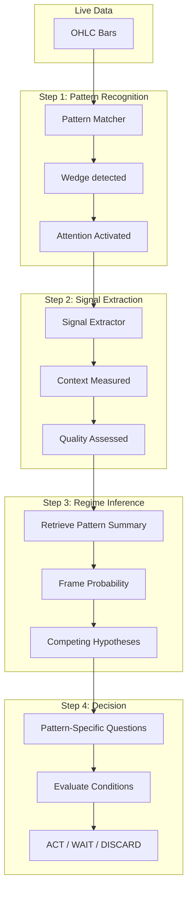
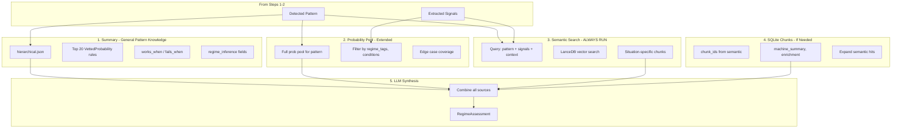

# Pattern-First Signal Pipeline

## Core Insight

This architecture mirrors the human discretionary trader's cognitive loop:

1. **Scan** → "Is that a wedge forming?" (pattern triggers attention)
2. **Confirm** → "Yes, converging highs/lows, 4 touches" (encyclopedia match)
3. **Contextualize** → "But follow-through is weak, late in trend, prior breakout failed" (atomic signals)
4. **Decide** → "Wait for more compression" or "Low probability, skip" (regime + context → action)

**The pattern gets you in the chair. The signals tell you whether to act.**

- Pattern without signals = overtrading (every wedge looks tradeable)
- Signals without pattern = no anchor (what am I even evaluating?)
- Sequential pipeline = human-like reasoning, systematized

## Architecture



## Why Pattern-First (Not Signal-First)

> "Is this a good wedge?" requires knowing it's a wedge first.

The pattern provides the **anchor** - it tells you what questions to ask:
- For a wedge: "Is compression increasing? Where in the trend? Prior breakout success rate?"
- For a double bottom: "Did the second test hold? Volume confirmation? Distance from first bottom?"

Without the pattern label, you don't know which signals matter. The signals are **context-specific** to the pattern being evaluated.

---

## ✅ COMPLETED: Three-Layer Signal Architecture (2026-01-26)

The signal detection system has been refactored into three clean layers:

| Layer | File | Count | Purpose |
|-------|------|-------|---------|
| **Layer 1: Tag Signals** | `src/signals/tag_signals.py` | 36 | Single bar classifications with OHLC rules |
| **Layer 2: Pattern Rules** | `src/signals/pattern_rules.py` | 168 | Multi-bar patterns with detection logic |
| **Layer 3: Atomic Signals** | `src/signals/vocabulary.py` | 44 | Continuous measurements for quality |
| **Total** | | **248** | Complete signal vocabulary |

**Architecture Map**: `.A_Retrieval.Logic PLAN/SIGNAL_ARCHITECTURE_MAP.md`

### Layer 1: Tag Signals (Single Bar)

Categories: Bar Type, Trend Bars, Reversal Bars, Signal Bars, Inside/Outside, Shaved, Gap, Surprise, Breakout, Close Position, EMA Position, Relative H/L

```python
from src.signals import get_tag_signal, ALL_TAG_SIGNALS
inside = get_tag_signal("inside_bar")
print(inside.ohlc_rule)  # "H < prior_H AND L > prior_L"
```

### Layer 2: Pattern Rules (Multi-Bar)

Categories: Objective (ii, ioi), Medium (double_top), High Subjectivity (wedge, triangle), Flags, Entry Patterns (High 1/2/3)

```python
from src.signals import get_pattern_rule, list_objective_patterns
wedge = get_pattern_rule("wedge_bull")
print(wedge.requires_swing_detection)  # True
```

### Layer 3: Atomic Signals (Continuous)

Categories: Bar Anatomy, Momentum, Overlap, Range, Gap, EMA, Structure, Breakout, Measured Move, Climax

```python
from src.signals import get_atomic_signal, list_tier0_signals
overlap = get_atomic_signal("overlap_ratio")
print(overlap.value_range)  # "0-1"
```

---

## Workstream 1: Signal Vocabulary ✅ COMPLETE

**Status**: Implemented with 115 total signals across three layers.

**Files Created**:
- `src/signals/tag_signals.py` - 36 tag signal definitions
- `src/signals/pattern_rules.py` - 168 pattern definitions
- `src/signals/vocabulary.py` - 44 atomic signal definitions
- `src/signals/__init__.py` - Unified exports

---

## Workstream 2: Regime-Centric Summary Schema

**Goal**: Extend `generate_hierarchical_summary.py` with Pass 5 for regime inference extraction.

**File**: [.A_Summary_SCRIPTS/generate_hierarchical_summary.py](.A_Summary_SCRIPTS/generate_hierarchical_summary.py)

### New Dataclasses

```python
@dataclass
class SignalReference:
    signal_id: str           # References vocabulary
    strength: str            # "required" | "strengthening" | "weakening"
    regime_modifier: dict[str, str]

@dataclass
class ClarifyingQuestion:
    question: str
    if_yes_implies: str
    if_no_implies: str
    data_source: str         # "bars" | "context" | "daily"

@dataclass
class Invalidation:
    condition: str
    signal_check: str        # References signal_id + threshold
    source: str

@dataclass
class ConfidenceFactors:
    increases: list[str]
    decreases: list[str]
    data_quality: str

@dataclass
class RegimeInference:
    signals: list[SignalReference]
    clarifying_questions: list[ClarifyingQuestion]
    invalidations: list[Invalidation]
    confidence: ConfidenceFactors
    regime_implications: dict  # if_confirmed, if_mixed, wait_conditions
```

### Pass 5 Implementation

- Input: `works_when`, `fails_when` from Pass 4
- Output: `RegimeInference` object
- Method: LLM extraction with structured output + JSON schema validation
- Fallback: Empty-but-valid `RegimeInference` if extraction fails

### Schema Update: `hierarchical_v4`

Add to JSON output:
- `provenance` block (git commit, tags version, probability hash)
- `regime_inference` block (signals, questions, invalidations, confidence)
- `associated_regimes` list

---

## Workstream 3: Sequential Pipeline Infrastructure

**Goal**: Build the pattern-first → signals → regime → decision pipeline.

### Step 1: Pattern Recognition (Existing)

**Files**: `src/live/pattern_matcher.py`, `src/live/tag_detector.py`

**Role**: Detect patterns that trigger attention. This is the ANCHOR.

**Output**: `DetectedPattern` with `pattern_id`, `confidence`, `matched_rules`

### Step 2: Signal Extraction (New)

**New File**: `src/live/signal_extractor.py`

```python
class SignalExtractor:
    def __init__(self, vocabulary: SignalVocabulary):
        self.vocab = vocabulary

    def extract_for_pattern(
        self,
        bars: list[BarCloseEvent],
        pattern: DetectedPattern
    ) -> PatternSignalContext:
        """Extract signals RELEVANT to the detected pattern.

        Different patterns need different signals:
        - Wedge: compression, follow-through, trend position
        - Double bottom: test strength, volume, distance
        - Breakout: prior failure rate, momentum, range context
        """
        relevant_signals = self.vocab.signals_for_pattern(pattern.pattern_id)
        return {sig.signal_id: self._compute(sig, bars) for sig in relevant_signals}
```

**Key insight**: Signals are pattern-specific. A wedge cares about compression. A breakout cares about prior failure rate.

### Step 3: Regime Inference (New) - Full Retrieval Flow

**New File**: `src/live/regime_inference.py`

#### Retrieval Architecture



#### The Four Retrieval Layers

**Layer 1: Hierarchical Summary (ALWAYS - baseline)**
- Source: `.A_Summaries/Enriched/{pattern}_hierarchical.json`
- Contains: Top 20 probs (baked in), works_when/fails_when, regime_inference fields
- Role: General pattern knowledge ("what wedges are, how they behave")
- Speed: Fast (pre-computed, file lookup)

**Layer 2: Probability Pool (CONDITIONAL - edge cases)**
- Source: SQLite `vetted_probability` or CLUSTERS.json
- Contains: Full set of probs beyond top 20 for this pattern
- Role: Cover edge cases not in top 20
- When: If extracted signals suggest unusual conditions

**Layer 3: Semantic Search (ALWAYS - situation-specific)**
- Source: LanceDB vector embeddings
- Query: Pattern + signals + inferred regime context
- Returns: Chunks from books/transcripts that match THIS situation
- Role: "What does Al Brooks say about THIS kind of wedge with THESE conditions?"
- **This is required** - summary alone is too generic

**Layer 4: SQLite Chunks (CONDITIONAL - expansion)**
- Source: SQLite chunk tables (books, transcripts, slides)
- Contains: Full machine_summary, enrichment fields
- When: Semantic hits need full context (chunk_id lookup)
- Role: Expand semantic results with complete chunk data

#### Why Semantic is Required (Not Optional)

| Source | Provides | Example |
|--------|----------|---------|
| **Summary** | Generic pattern knowledge | "Wedges often fail, watch compression" |
| **Semantic** | Situation-specific context | "Wedge with weak follow-through after 3 pushes late in uptrend = high probability reversal" |

**Summary = what the pattern IS.**
**Semantic = what to do in THIS situation.**

Both are required. Summary alone is insufficient.

#### Implementation

```python
class RegimeInference:
    def __init__(
        self,
        summary_loader: SummaryLoader,      # Layer 1: hierarchical JSON
        probability_pool: ProbabilityPool,  # Layer 2: extended probs
        semantic_search: LanceDBSearch,     # Layer 3: vector search
        chunk_store: ChunkStore             # Layer 4: SQLite chunks
    ):
        self.summaries = summary_loader
        self.prob_pool = probability_pool
        self.semantic = semantic_search
        self.chunks = chunk_store

    def infer(
        self,
        pattern: DetectedPattern,
        signals: PatternSignalContext,
    ) -> RegimeAssessment:
        """Full multi-source retrieval → synthesis → assessment."""

        # Layer 1: Get pre-computed summary (ALWAYS)
        summary = self.summaries.load(pattern.pattern_id)

        # Layer 2: Get extended probs if edge case (CONDITIONAL)
        extended_probs = None
        if self._is_edge_case(signals, summary.probabilities):
            extended_probs = self.prob_pool.get_for_pattern(
                pattern_id=pattern.pattern_id,
                regime_tags=self._infer_regime_tags(signals),
                exclude_ids=[p.rule_id for p in summary.probabilities]
            )

        # Layer 3: Semantic search for situation-specific context (ALWAYS)
        query = self._build_query(pattern, signals)
        semantic_hits = self.semantic.search(
            query=query,
            top_k=10,
            filters={"pattern_tags": pattern.pattern_id}
        )

        # Layer 4: Expand semantic hits if needed (CONDITIONAL)
        expanded_chunks = None
        if self._needs_expansion(semantic_hits):
            chunk_ids = [hit.chunk_id for hit in semantic_hits[:5]]
            expanded_chunks = self.chunks.get_full(chunk_ids)

        # Synthesize all sources → RegimeAssessment
        return self._synthesize(
            pattern=pattern,
            signals=signals,
            summary=summary,
            extended_probs=extended_probs,
            semantic_hits=semantic_hits,
            expanded_chunks=expanded_chunks
        )

    def _build_query(self, pattern: DetectedPattern, signals: dict) -> str:
        """Build semantic query from pattern + signals."""
        # Example: "wedge pattern with weak follow-through, high compression,
        #           late in uptrend, near measured move target"
        signal_desc = ", ".join(f"{k}: {v:.2f}" for k, v in signals.items())
        return f"{pattern.pattern_id} pattern with {signal_desc}"

    def _synthesize(self, ...) -> RegimeAssessment:
        """LLM combines all retrieved information."""
        prompt = f'''Assess this trading situation:

PATTERN: {pattern.pattern_id} (confidence: {pattern.confidence})

SIGNALS: {signals}

SUMMARY KNOWLEDGE (general):
- Works when: {summary.works_when[:3]}
- Fails when: {summary.fails_when[:3]}
- Top probabilities: {summary.probabilities[:5]}

SITUATION-SPECIFIC CONTEXT (from semantic search):
{semantic_hits[:5]}

{f"EXTENDED PROBABILITIES: {extended_probs}" if extended_probs else ""}
{f"DETAILED CHUNKS: {expanded_chunks}" if expanded_chunks else ""}

Provide:
1. regime_hypothesis: Most likely regime
2. competing_hypotheses: What else could this be?
3. confidence: 0.0-1.0 with factors that increase/decrease
4. clarifying_questions: What to check before acting
5. recommendation: ACT / WAIT / DISCARD with reason
'''
        return self._call_llm(prompt)
```

### Step 4: Decision Engine (New)

**New File**: `src/live/decision_engine.py`

```python
class DecisionEngine:
    def decide(
        self,
        pattern: DetectedPattern,
        signals: PatternSignalContext,
        regime: RegimeAssessment
    ) -> Decision:
        """Evaluate conditions → ACT / WAIT / DISCARD.

        Logic:
        - Check invalidations: Any signal that kills the setup?
        - Check confidence: Above threshold for action?
        - Check questions: Any unanswered that require WAIT?
        - Default: DISCARD if uncertainty too high
        """
        # Check invalidations from summary
        for inv in regime.invalidations:
            if self._check_invalidation(inv, signals):
                return Decision(action="DISCARD", reason=inv.condition)

        # Check if questions are answered
        unanswered = [q for q in regime.questions if not self._can_answer(q, signals)]
        if unanswered:
            return Decision(action="WAIT", reason=f"Need: {unanswered[0].question}")

        # Check confidence threshold
        if regime.confidence < CONFIDENCE_THRESHOLD:
            return Decision(action="DISCARD", reason="Low confidence")

        return Decision(action="ACT", reason=regime.if_confirmed)
```

---

## Workstream 4: Decision Log (Learning Infrastructure)

**Goal**: Track decisions to learn which signals/questions matter most.

**File**: `src/live/decision_log.py` + SQLite table

### Schema

```sql
CREATE TABLE decision_log (
    id INTEGER PRIMARY KEY,
    timestamp TEXT NOT NULL,
    bar_number INTEGER,

    -- Step 1: Pattern
    pattern_id TEXT,
    pattern_confidence REAL,

    -- Step 2: Signals
    signals_extracted JSON,

    -- Step 3: Regime
    regime_hypothesis TEXT,
    competing_hypotheses JSON,
    confidence REAL,
    questions_generated JSON,

    -- Step 4: Decision
    action TEXT,  -- 'ACT' | 'WAIT' | 'DISCARD'
    reason TEXT,

    -- Outcome (filled post-session)
    outcome JSON,
    was_correct BOOLEAN,
    which_signals_mattered JSON,
    notes TEXT
);
```

### Metrics to Track

- **Pattern → Decision rate**: How often does pattern detection lead to ACT vs WAIT vs DISCARD?
- **Signal contribution**: Which signals most often appear in correct ACT decisions?
- **Question value**: Which questions, when answered, changed the decision?
- **Invalidation accuracy**: When we DISCARD due to invalidation, was that correct?

---

## Thin Slice Proof of Concept

**Scope**: One pattern (`wedge`), 8 core signals relevant to wedges, full pipeline end-to-end.

### Why Wedge?

Wedge is ideal for POC because:
- Clear structural definition (converging highs/lows)
- Multiple relevant signals (compression, follow-through, trend position)
- Common in Al Brooks material (well-documented)
- Has clear success/failure modes (breakout vs failed breakout)

### POC Steps

1. **Vocabulary**: Implement 8 signals relevant to wedges in `src/signals/vocabulary.py`
   - `range_compression` - Is the range shrinking?
   - `follow_through_bull/bear` - Momentum confirmation
   - `ema_distance` - Where in the trend?
   - `overlap_ratio` - Congestion level
   - `body_dominance` - Conviction of recent bars
   - `breakout_failure_rate` - Prior breakout success
   - `leg_count` - How many pushes?
   - `touch_count` - Trendline touches

2. **Signal Extractor**: Build `src/live/signal_extractor.py` with `signals_for_pattern("wedge")`

3. **Summary Update**: Add Pass 5 to `generate_hierarchical_summary.py`, regenerate `wedge` summary

4. **Regime Inference**: Build `src/live/regime_inference.py` that takes pattern + signals → assessment

5. **Decision Engine**: Build `src/live/decision_engine.py` for ACT/WAIT/DISCARD

6. **Decision Log**: Log each step for learning

7. **Test**: Run on recorded session with known wedge formations

### Success Criteria

- Pipeline correctly identifies wedge → extracts relevant signals → retrieves summary
- Decision engine produces reasonable ACT/WAIT/DISCARD based on signal quality
- Decision log captures enough data to identify which signals matter most

---

## File Changes Summary

| File | Action | Step |
|------|--------|------|
| `src/signals/vocabulary.py` | Create | Signal Vocabulary |
| `src/signals/__init__.py` | Create | Signal Vocabulary |
| `src/live/signal_extractor.py` | Create | Step 2 |
| `src/live/regime_inference.py` | Create | Step 3 |
| `src/live/decision_engine.py` | Create | Step 4 |
| `src/live/decision_log.py` | Create | Learning |
| `.A_Summary_SCRIPTS/generate_hierarchical_summary.py` | Modify | Pass 5 |
| `alembic/versions_v2/0028_decision_log.py` | Create | Learning |

---

## Execution Order

Phase 1: Foundation
├── Vocabulary (8 wedge-relevant signals)
└── Decision Log schema

Phase 2: Pipeline
├── Signal Extractor (pattern-specific extraction)
├── Pass 5 (regime inference fields in summaries)
└── Regenerate wedge summary

Phase 3: Integration
├── Regime Inference (pattern + signals → assessment)
└── Decision Engine (assessment → ACT/WAIT/DISCARD)

Phase 4: Test
└── Run on recorded session, evaluate results

Dependencies:
- Vocabulary must exist before Signal Extractor
- Signal Extractor must exist before Regime Inference
- Pass 5 must exist before summaries have regime_inference fields
- Decision Log can be built in parallel with Phase 1

---

## Pattern-Signal Mapping (To Expand)

Each pattern has signals that matter for evaluating its quality:

| Pattern | Key Signals |
|---------|-------------|
| `wedge` | compression, follow-through, ema_distance, touch_count, leg_count |
| `failed_breakout` | breakout_failure_rate, follow-through, overlap_ratio, range_context |
| `double_bottom` | test_strength, distance_between, volume_confirmation, support_hold |
| `trend_bar` | body_dominance, close_position, follow_through |

This mapping lives in `src/signals/vocabulary.py` and drives what signals get extracted for each pattern.

---

## Open Questions (Resolve During Implementation)

1. **Signal vocabulary storage**: Python dataclasses (start here) → migrate to JSON/SQLite if needed
2. **Pattern-signal mapping**: Hardcoded initially → extract from summaries via Pass 5 later
3. **Confidence thresholds**: Start conservative (high threshold for ACT), tune via decision log
4. **WAIT conditions**: What triggers re-evaluation? Time-based? Signal change? New bar?

---

## The Big Picture (Plain English)

### The Problem

Right now, the system can detect patterns like "wedge" or "double bottom" from price bars. But detecting a pattern isn't enough to make a trading decision. Not every wedge is worth trading. Some are great setups, some are traps.

A human trader doesn't just see "wedge" and trade. They ask: "Is this a good wedge? Is the market compressing? Are we late in the trend? Did the last breakout fail?"

**The pattern gets you in the chair. But you need more information to decide whether to act.**

---

### The Solution: Mirror How Humans Think

We're building a 4-step pipeline that mimics a discretionary trader's thought process:

**Step 1: Pattern Recognition (The Anchor)**
> "Is that a wedge forming?"

The existing pattern matcher detects structural patterns. When it sees converging highs and lows, it says "wedge detected." This is the **trigger** - it tells the system to pay attention.

**Step 2: Signal Extraction (The Quality Check)**
> "Okay it's a wedge, but is it a good one?"

Now we measure **context** around that wedge:
- Is the range compressing? (good sign)
- Is there follow-through on recent bars? (weak = setup may fail)
- Where are we relative to the moving average? (late in trend = lower probability)
- Have prior breakouts from this area failed? (high failure rate = favor fade)

These are **atomic signals** - factual measurements from the price bars that help assess quality.

**Step 3: Regime Inference (Framing the Probability)**
> "Given this wedge with these signals, what's the likely outcome?"

We retrieve the stored knowledge about wedges (from Al Brooks books, transcripts, etc.) and combine it with the measured signals to answer:
- What regime are we likely in? (trend continuation? reversal setup?)
- What competing hypotheses exist? (this could be a pullback OR a reversal)
- What would increase/decrease confidence?
- What questions should we ask before acting?

**Step 4: Decision (ACT / WAIT / DISCARD)**
> "Do I trade this, wait for more info, or skip it?"

Based on the regime assessment:
- **ACT**: Signals are strong, questions answered, confidence high
- **WAIT**: Some signals unclear, need more bars or confirmation
- **DISCARD**: Invalidation triggered, or confidence too low

---

### Why This Matters

**Without signals**: Every wedge looks tradeable → overtrading, lots of losses on mediocre setups

**Without patterns**: You're just looking at numbers with no anchor → "what am I even evaluating?"

**With both**: You know WHAT you're looking at (wedge), and you know WHETHER it's worth trading (signals say yes/no)

---

### The Proof of Concept

We're starting with **wedges** because:
- Clear definition (converging highs/lows)
- Well-documented in Al Brooks material
- Has obvious quality signals (compression, follow-through, trend position)
- Clear success/failure modes (breakout works vs fails)

We'll build:
1. **8 signals** specifically relevant to evaluating wedges
2. **Signal extractor** that knows "for a wedge, measure these 8 things"
3. **Updated summaries** that include what signals matter, what questions to ask, what invalidates the setup
4. **Decision engine** that combines pattern + signals → ACT/WAIT/DISCARD
5. **Decision log** to track what worked, so we can learn which signals actually matter

---

### The Key Insight

> **"Is this a good wedge?" requires knowing it's a wedge first.**

The pattern label tells you what questions to ask. A wedge cares about compression. A breakout cares about prior failure rate. A double bottom cares about whether the second test held.

Without the pattern, you don't know which signals are relevant. The pattern is the anchor that makes the signals meaningful.

---

### What We're NOT Doing

- We're NOT doing A/B testing of two competing approaches
- We're NOT building a pure "signal-first" system that ignores patterns
- We're NOT making the pattern the decision (that leads to overtrading)

We're building **ONE sequential pipeline**: Pattern → Signals → Regime → Decision

That's it. Simple, coherent, mirrors how humans actually think.
